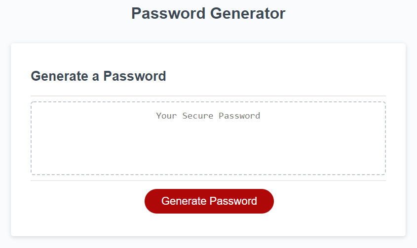

# 03 JavaScript: Password Generator

Create an application that generates a random password based on user-selected criteria. This app will run in the browser and feature dynamically updated HTML and CSS powered by your JavaScript code. It will also feature a clean and polished user interface and be responsive, ensuring that it adapts to multiple screen sizes.

If you are unfamiliar with special characters, take a look at [some examples](https://www.owasp.org/index.php/Password_special_characters).

## User Story

```
AS AN employee with access to sensitive data
I WANT to randomly generate a password that meets certain criteria
SO THAT I can create a strong password that provides greater security
```

## Acceptance Criteria

```
GIVEN I need a new, secure password
WHEN I click the button to generate a password
THEN I am presented with a series of prompts for password criteria
WHEN prompted for the length of the password
THEN I choose a length of at least 8 characters and no more than 128 characters
  Code a prompt that asks the user for how many characters in the password
  Must be between 8 and 128
  Store response in a variable
WHEN prompted for character types to include in the password
THEN I choose lowercase, uppercase, numeric, and/or special characters
  Confirm for lowercase
  Confirm for uppercase
  Confirm for numeric
  Confirm for special characters
WHEN all prompts are answered
THEN a password is generated that matches the selected criteria
  Create an array for lowercase letters [ "a", "b", "c", ...]
  Create an empty array that will hold all characters allowed in the solution
  If user chose lowercase:
    Add all lower case options to that array
  We end up with ONE BIG ARRAY that holds all possible characters in the solution
  Create an empty string for the final password
  Loop from 1 to the number of characters in the password  // ex 100
    Determine a random number between 0 and the length-1 of our ONE BIG ARRAY
    Whatever that random index is, grab that value, and add it to the password string
WHEN the password is generated
THEN the password is either displayed in an alert or written to the page
The following image demonstrates the application functionality:



## Review

You are required to submit the following for review:

* The URL of the deployed application.

* The URL of the GitHub repository. Give the repository a unique name and include a README describing the project.

- - -
© 2019 Trilogy Education Services, a 2U, Inc. brand. All Rights Reserved.
